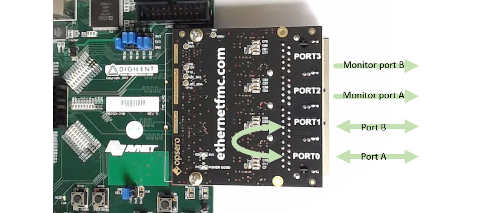
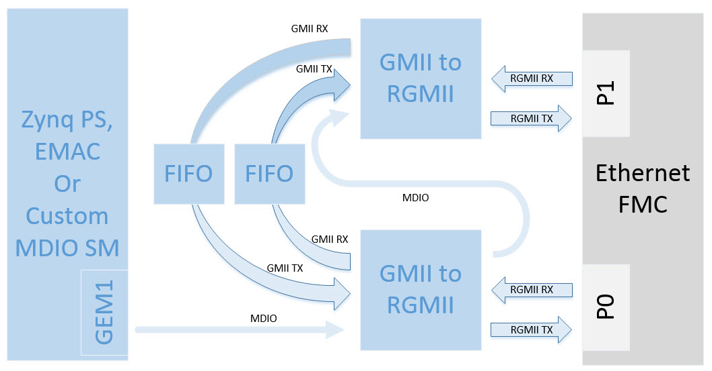

# Network Tap for the Ethernet FMC

Hackable FPGA based network tap that uses the Opsero [Ethernet FMC] (OP031) or [Robust Ethernet FMC] (OP041).



## Requirements

This project is designed for version 2025.2 of the Xilinx tools (Vivado/Vitis). If you are using an older version of the 
Xilinx tools, then refer to the [release tags](https://github.com/fpgadeveloper/ethernet-fmc-network-tap/tags "releases")
to find the version of this repository that matches your version of the tools.

* Vivado 2025.2
* Vitis 2025.2
* [Ethernet FMC] or [Robust Ethernet FMC]
* One of the below listed evaluation boards

## Supported carrier boards

* Zynq-7000 [ZedBoard](http://zedboard.org "ZedBoard")
  * LPC connector
* Zynq UltraScale+ [ZCU102 Evaluation board](https://www.xilinx.com/zcu102 "ZCU102 Evaluation board")
  * HPC0 connector

## Description

This project will implement an FPGA based network tap which could be used to "listen" to the communications passing over
an Ethernet cable. It is a work that is still under development.



The design in it's present state implements a pass-through between PORT0 and PORT1 of the Ethernet FMC.
The pass-through is fully functional and can be tested by connecting ports 0 and 1 to separate Ethernet
devices.

## Build instructions

Clone the repo and change into its directory:
```
git clone https://github.com/fpgadeveloper/ethernet-fmc-network-tap.git
cd ethernet-fmc-network-tap
```

### Cross-platform build runner

All builds are driven by `build.py` at the repo root, on both Windows
(git bash) and Linux. The `build.sh` / `build.bat` shim finds a suitable
Python 3 automatically (including the one bundled with the AMD tools).
Pick a target design label from the tables above (or run `./build.sh
list`), then run the build command for the stage(s) you want — each
command builds whatever it depends on automatically and skips anything
already built. On Windows without git bash, run the same commands from
Command Prompt or PowerShell using `build.bat` (e.g. `build.bat xsa
--target <target>`).

You don't need to source the AMD tools first — the build runner finds
Vivado, Vitis and PetaLinux automatically in their standard install
locations and sets up the environment each stage needs. If your tools
are installed somewhere non-standard and the runner can't find them,
source the tool settings yourself before running the build.

#### Build the Vivado project (bitstream + XSA)

```
./build.sh xsa --target <target>
```

#### Build the standalone application

Builds the Vitis workspace and the baremetal boot file (`BOOT.BIN` or
bit file, depending on the device family):

```
./build.sh standalone --target <target>
```

#### Build everything

Builds all of the above that the target supports, then gathers the boot
images into `bootimages/*.zip`:

```
./build.sh all --target <target>
./build.sh all --target all          # every target in the repo
```

Also available: `status`, `clean`, `project` — see
`./build.sh --help`. On Windows, the PetaLinux and Yocto stages require a
Linux machine; the runner says so and prints the hand-off command. The
legacy `make` interface still works on Linux (each Makefile now wraps
`build.sh`) but is deprecated and will be removed at the next version
update.

## Tutorials

The following tutorials explain the workings of the network tap:

* [FPGA Network Tap: Designing the Ethernet pass through](http://www.fpgadeveloper.com/2015/12/fpga-network-tap-designing-ethernet-pass-through.html "FPGA Network Tap: Designing the Ethernet pass through")

## lwIP Echo Server

The lwIP echo server application is used here to simplify testing the design. We run the
echo server on the carrier board's onboard Ethernet port, which allows
us to use only one PC to send and receive packets over the "tapped" link. To test
this application, you must make the following connections:

* Carrier board's on-board Ethernet connector to PORT1 of the Ethernet FMC
* PORT0 of the Ethernet FMC to your PC's Ethernet port or a network router

Now when the application is running, you will be able to send packets from your PC
through PORT0, out of PORT1, into the carrier board's Ethernet port, from which point they
will be echoed by the echo server and come back through the same path to your PC.

## Troubleshooting

Check the following if the project fails to build or generate a bitstream:

### 1. Are you using the correct version of Vivado for this version of the repository?
Check the version specified in the Requirements section of this readme file. Note that this project is regularly maintained to the latest
version of Vivado and you may have to refer to an earlier commit of this repo if you are using an older version of Vivado.

### 2. Did you follow the Build instructions in this readme file?
All the projects in the repo are built, synthesised and implemented to a bitstream before being committed, so if you follow the
instructions, there should not be any build issues.

### 3. Did you copy/clone the repo into a short directory structure?
Vivado doesn't cope well with long directory structures, so copy/clone the repo into a short directory structure such as
`C:\projects\`. When working in long directory structures, you can get errors relating to missing files, particularly files 
that are normally generated by Vivado (FIFOs, etc).

## Contribute

We encourage contribution to these projects. If you spot issues or you want to add designs for other platforms, please
make a pull request.

## About us

This project was developed by [Opsero Inc.](http://opsero.com "Opsero Inc."),
a tight-knit team of FPGA experts delivering FPGA products and design services to start-ups and tech companies. 
Follow our blog, [FPGA Developer](http://www.fpgadeveloper.com "FPGA Developer"), for news, tutorials and
updates on the awesome projects we work on.

[Ethernet FMC]: https://docs.opsero.com/op031/datasheet/overview/
[Robust Ethernet FMC]: https://docs.opsero.com/op041/datasheet/overview/
