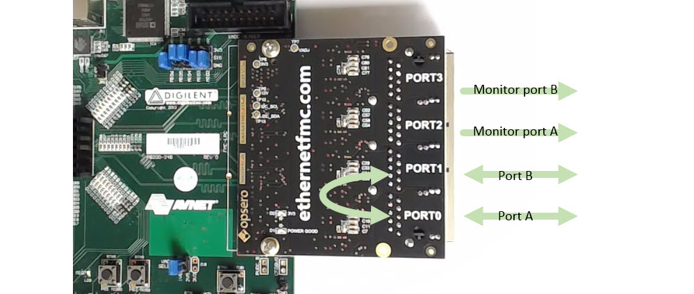
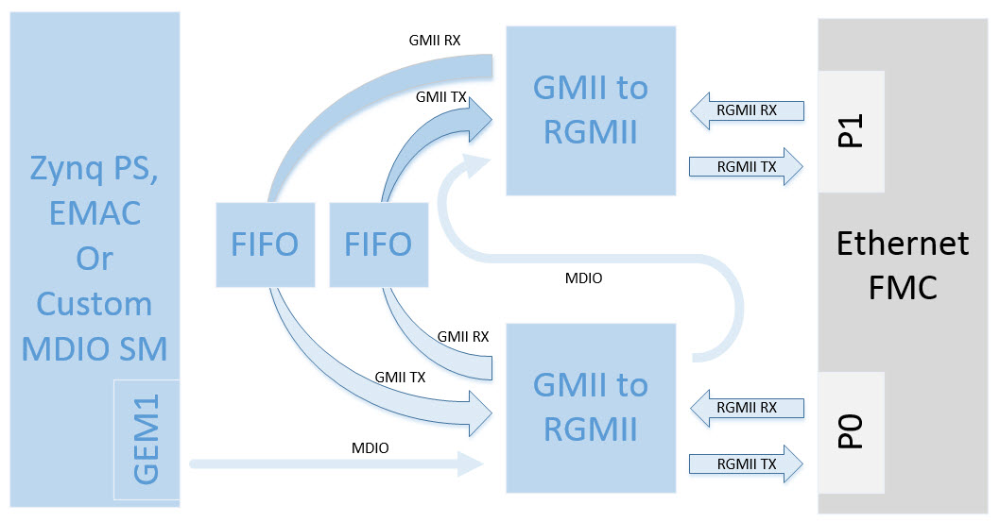

# Network Tap for the Ethernet FMC

Hackable FPGA based network tap that uses the [Quad Gigabit Ethernet FMC](http://ethernetfmc.com "Ethernet FMC").



## Requirements

This project is designed for version 2022.1 of the Xilinx tools (Vivado/Vitis). If you are using an older version of the 
Xilinx tools, then refer to the [release tags](https://github.com/fpgadeveloper/ethernet-fmc-network-tap/tags "releases")
to find the version of this repository that matches your version of the tools.

* Vivado 2022.1
* Vitis 2022.1
* [Ethernet FMC](https://ethernetfmc.com "Ethernet FMC")
* One of the below listed evaluation boards

## Supported carrier boards

* Zynq-7000 [ZedBoard](http://zedboard.org "ZedBoard")
  * LPC connector
* Zynq UltraScale+ [ZCU102 Evaluation board](https://www.xilinx.com/zcu102 "ZCU102 Evaluation board")
  * HPC0 connector

## Description

This project will implement an FPGA based network tap which could be used to "listen" to the communications passing over
an Ethernet cable. It is a work that is still under development.



The design in it's present state implements a pass-through between PORT0 and PORT1 of the Ethernet FMC.
The pass-through is fully functional and can be tested by connecting ports 0 and 1 to separate Ethernet
devices.

## Build instructions

To use the sources in this repository, please follow these steps:

### Windows users

1. Download the repo as a zip file and extract the files to a directory
   on your hard drive --OR-- Git users: clone the repo to your hard drive
2. Open Windows Explorer, browse to the repo files on your hard drive.
3. In the `Vivado` directory, double click on the `build-vivado.bat` batch file.
   You will be prompted to select a target design to build. You will find the project in
   the folder `Vivado/<target>`.
4. Run Vivado and open the project that was just created.
5. Click Generate bitstream.
6. When the bitstream is successfully generated, select `File->Export->Export Hardware`.
   In the window that opens, tick "Include bitstream" and "Local to project".
7. Return to Windows Explorer and browse to the Vitis directory in the repo.
8. Double click the `build-vitis.bat` batch file. You will be prompted to select the
   target design. The Vitis workspace will be found in the `<target>_workspace` folder.
9. Run Xilinx Vitis and select the workspace folder that was just created.
10. Connect and power up the hardware.
11. Open a Putty terminal to view the UART output.
12. Right-click on the application and select `Run As->Launch on Hardware (Single Application Debug)`

### Linux users

1. Open a command terminal and launch the setup script for Vivado and Vitis:
   ```
   source <path-to-vivado-install>/2022.1/settings64.sh
   source <path-to-vitis-install>/2022.1/settings64.sh
   ```
2. Clone the Git repository and `cd` into the repo:
   ```
   git clone https://github.com/fpgadeveloper/ethernet-fmc-network-tap.git
   cd ethernet-fmc-network-tap
   ```
3. Run make to build the Vivado project and the Vitis workspace for the target board. You must replace 
   `<target>` with a valid target:
   ```
   make bootimage TARGET=<target>
   ```
   Valid targets are: 
   `zedboard`,`zcu102_hpc0`.
4. Launch the Vitis GUI. When asked to select the workspace path, select the `Vitis/<target>_workspace` directory.
5. Power up your hardware platform and ensure that the JTAG is connected properly.
6. In the Vitis Explorer panel, double-click on the System project that you want to run -
   this will reveal the application contained in the project. The System project will have 
   the postfix "_system".
7. Now right click on the application "echo_server" then navigate the
   drop down menu to **Run As->Launch on Hardware (Single Application Debug (GDB)).**.


## Tutorials

The following tutorials explain the workings of the network tap:

* [FPGA Network Tap: Designing the Ethernet pass through](http://www.fpgadeveloper.com/2015/12/fpga-network-tap-designing-ethernet-pass-through.html "FPGA Network Tap: Designing the Ethernet pass through")

## lwIP Echo Server

The lwIP echo server application is used here to simplify testing the design. We run the
echo server on the carrier board's onboard Ethernet port, which allows
us to use only one PC to send and receive packets over the "tapped" link. To test
this application, you must make the following connections:

* Carrier board's on-board Ethernet connector to PORT1 of the Ethernet FMC
* PORT0 of the Ethernet FMC to your PC's Ethernet port or a network router

Now when the application is running, you will be able to send packets from your PC
through PORT0, out of PORT1, into the carrier board's Ethernet port, from which point they
will be echoed by the echo server and come back through the same path to your PC.

## Troubleshooting

Check the following if the project fails to build or generate a bitstream:

### 1. Are you using the correct version of Vivado for this version of the repository?
Check the version specified in the Requirements section of this readme file. Note that this project is regularly maintained to the latest
version of Vivado and you may have to refer to an earlier commit of this repo if you are using an older version of Vivado.

### 2. Did you follow the Build instructions in this readme file?
All the projects in the repo are built, synthesised and implemented to a bitstream before being committed, so if you follow the
instructions, there should not be any build issues.

### 3. Did you copy/clone the repo into a short directory structure?
Vivado doesn't cope well with long directory structures, so copy/clone the repo into a short directory structure such as
`C:\projects\`. When working in long directory structures, you can get errors relating to missing files, particularly files 
that are normally generated by Vivado (FIFOs, etc).

## Contribute

We encourage contribution to these projects. If you spot issues or you want to add designs for other platforms, please
make a pull request.

## About us

This project was developed by [Opsero Inc.](http://opsero.com "Opsero Inc."),
a tight-knit team of FPGA experts delivering FPGA products and design services to start-ups and tech companies. 
Follow our blog, [FPGA Developer](http://www.fpgadeveloper.com "FPGA Developer"), for news, tutorials and
updates on the awesome projects we work on.
